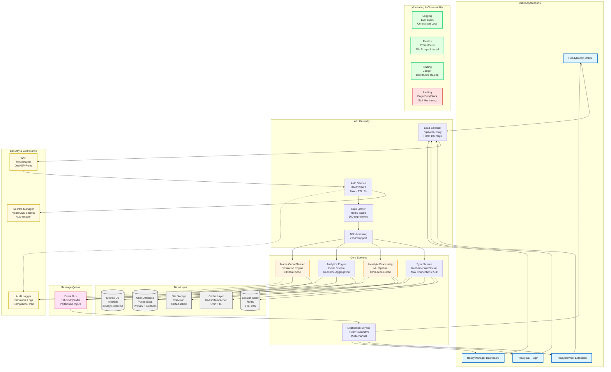

<!-- HEADY_BRAND:BEGIN
<!-- ╔══════════════════════════════════════════════════════════════════╗
<!-- ║  ██╗  ██╗███████╗ █████╗ ██████╗ ██╗   ██╗                     ║
<!-- ║  ██║  ██║██╔════╝██╔══██╗██╔══██╗╚██╗ ██╔╝                     ║
<!-- ║  ███████║█████╗  ███████║██║  ██║ ╚████╔╝                      ║
<!-- ║  ██╔══██║██╔══╝  ██╔══██║██║  ██║  ╚██╔╝                       ║
<!-- ║  ██║  ██║███████╗██║  ██║██████╔╝   ██║                        ║
<!-- ║  ╚═╝  ╚═╝╚══════╝╚═╝  ╚═╝╚═════╝    ╚═╝                        ║
<!-- ║                                                                  ║
<!-- ║  ∞ SACRED GEOMETRY ∞  Organic Systems · Breathing Interfaces    ║
<!-- ║  ━━━━━━━━━━━━━━━━━━━━━━━━━━━━━━━━━━━━━━━━━━━━━━━━━━━━━━━━━━━━━━━━  ║
<!-- ║  FILE: docs/guides/SERVICE_INTEGRATION.md                                                    ║
<!-- ║  LAYER: docs                                                  ║
<!-- ╚══════════════════════════════════════════════════════════════════╝
<!-- HEADY_BRAND:END
-->
# Heady Service Integration

## Core Services


## Service Level Objectives (SLOs)

| Service | Availability | Latency (p95) | Throughput |
|---------|-------------|---------------|------------|
| Sync Service | 99.95% | < 100ms | 50k concurrent |
| HeadyAI Processing | 99.9% | < 500ms | 1k req/s |
| Monte Carlo Planner | 99.9% | < 2s | 100 req/s |
| Analytics Engine | 99.95% | < 200ms | 5k events/s |
| Notification Service | 99.5% | < 1s | 10k msg/s |

## Data Flow Patterns

### 1. Real-time Sync Flow
```
Client → WebSocket → Sync Service → Event Bus → [AI Processing, Analytics, Storage]
```

### 2. AI Processing Pipeline
```
Request → Queue → GPU Workers → Model Inference → Result Cache → Response
```

### 3. Analytics Aggregation
```
Events → Stream Processor → Time-series DB → Dashboard/Alerts
    
    I -.-> T
    J -.-> T
    K -.-> T
    M -.-> T
    
    E -.-> U
    I -.-> U
    J -.-> U
    K -.-> U
    M -.-> U
    
    I -.-> V
    J -.-> V
    K -.-> V
    M -.-> V
    
    U --> W
    T --> W
    V --> W
    
    style A fill:#e1f5ff
    style B fill:#e1f5ff
    style C fill:#e1f5ff
    style D fill:#e1f5ff
    style J fill:#fff4e1
    style M fill:#fff4e1
    style N fill:#f0f0f0
    style O fill:#f0f0f0
    style P fill:#f0f0f0
    style Q fill:#f0f0f0
    style R fill:#f0f0f0
    style S fill:#ffe1f5
    style T fill:#e1ffe1
    style U fill:#e1ffe1
    style V fill:#e1ffe1
    style W fill:#ffe1e1
    style X fill:#fff9e1
    style Y fill:#fff9e1
    style Z fill:#fff9e1
```
graph LR
  A[HeadyBuddy] --> B[Sync Service]
  C[HeadyBrowser] --> B
  D[HeadyIDE] --> B
  B --> E[HeadyAI Processing]
  E --> F[Data Storage]
```

## Integration Points
1. **Authentication**: Central auth service
2. **Data Sync**: WebSocket-based real-time sync
3. **AI Processing**: Unified API endpoint
